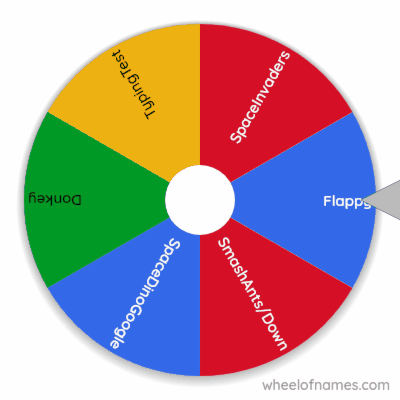
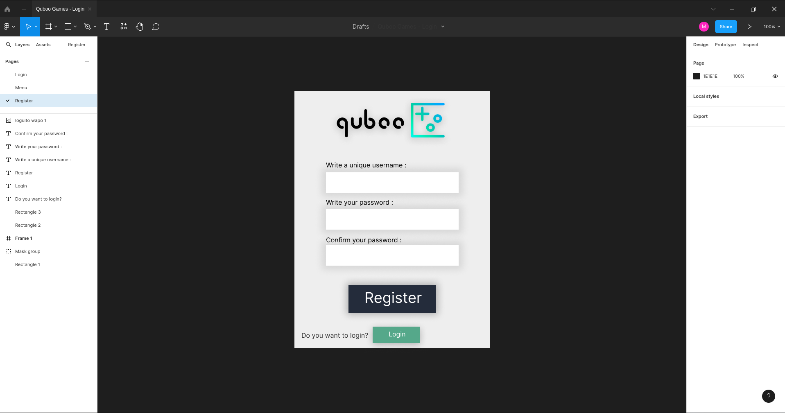
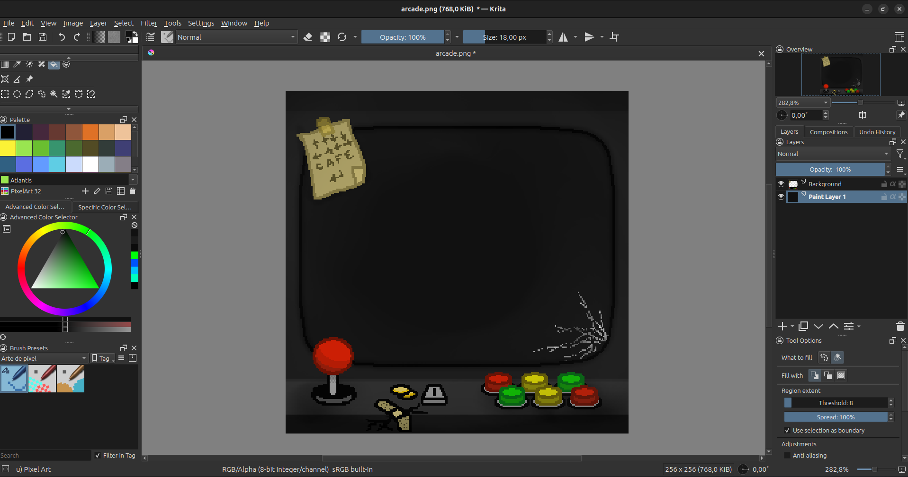

  

# Una sencilla aplicación para jugar videojuegos.
Quboo es el proyecto creado para el trabajo de primero de DAM en el módulo de programación.

## Java, Java Swing y JDBC.
Durante el segundo y el tercer trimestre hemos estado aprendiendo a programar en . Un lenguaje de programación enfocado a la  o Programación Orientada a Objetos que nos ha estado dando algunos dolores de cabeza. A parte, También hemos aprendido a usar ), una biblioteca de Java para desarrollar entornos gráficos con los que podemos desarrollar nuestros programas. Y por último, también hemos aprendido a utilizar otra libreria llamada , con la que podemos conectar nuestra aplicacinón a ua base de datos y realizar distintas operaciones.

## Idealización.
### Planteamiento de los videojuegos:
Para hacer mi programa, tenía pensado usar tanto Java como , otro lenguaje de programación aprendido durante el primer trimestre de DAM, con el cual, visualizaba crear algunos videojuegos que se conectaran con el programa de Java.

Para elegir que videojuegos hacer, mi compañero  hizo una ruleta rusa con la que se me asignaría crear los siguientes juegos:

De los cuáles salieron victoriosos el **Pong**, el **Snake**, el **Pac-Man**, el **Jump-Man** y por último un **Typing test**.

Para estos juegos, tenía pensado usar una librería bastante famosa de Python llamada . Aunque juegos como el **Snake**, el **Pac-Man** o el **Jump-Man**, los acabaría creando con otra librería de Python aún más potente que Pygame llamada .

### Login y Register:
Una vez sabido qué juegos tenía que hacer. Pasé a plantear diseños de cómo deberían verse el inicio de sesión y el registro de usuarios. Por tanto, para el apartado artístico usé estas dos aplicaciones:

Con los que creé mis diseños tanto del inicio de sesión, como el registro de usuarios y como también cree mi programa central o main:

  

  

  

