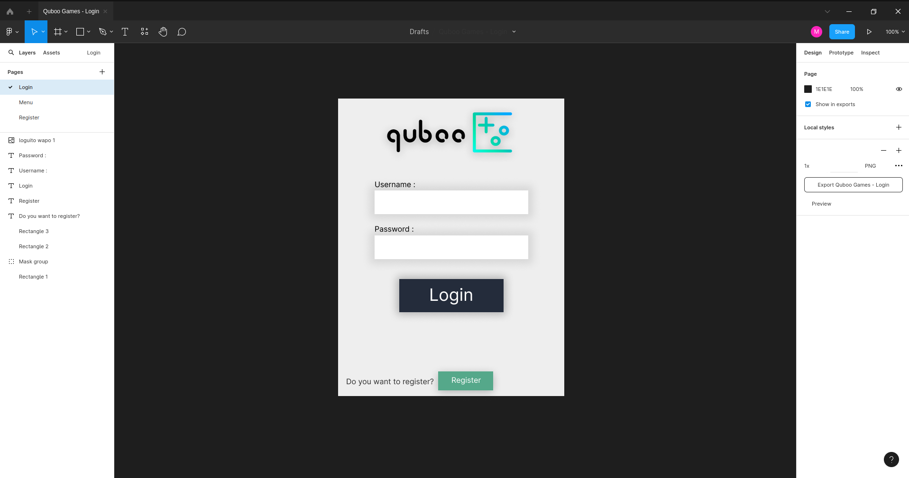

<p align="center">
  
</p>

# Una sencilla aplicación para jugar videojuegos.
Quboo es el proyecto creado para el trabajo de primero de DAM en el módulo de programación.

## Java, Java Swing y JDBC.
Durante el segundo y el tercer trimestre hemos estado aprendiendo a programar en . Un lenguaje de programación enfocado a la  o Programación Orientada a Objetos que nos ha estado dando algunos dolores de cabeza. A parte, También hemos aprendido a usar ), una biblioteca de Java para desarrollar entornos gráficos con los que podemos desarrollar nuestros programas. Y por último, también hemos aprendido a utilizar otra libreria llamada , con la que podemos conectar nuestra aplicacinón a ua base de datos y realizar distintas operaciones.

## Idealización.
### Planteamiento de los videojuegos:
Para hacer mi programa, tenía pensado usar tanto Java como , otro lenguaje de programación aprendido durante el primer trimestre de DAM, con el cual, visualizaba crear algunos videojuegos que se conectaran con el programa de Java.

Para elegir que videojuegos hacer, mi compañero  hizo una ruleta rusa con la que se me asignaría crear los siguientes juegos:


De los cuáles salieron victoriosos el **Pong**, el **Snake**, el **Pac-Man**, el **Jump-Man** y por último un **Typing test**.

Para estos juegos, tenía pensado usar una librería bastante famosa de Python llamada . Aunque juegos como el **Snake**, el **Pac-Man** o el **Jump-Man**, los acabaría creando con otra librería de Python aún más potente que Pygame llamada .

### Login y Register:
Una vez sabido qué juegos tenía que hacer. Pasé a plantear diseños de cómo deberían verse el inicio de sesión y el registro de usuarios. Por tanto, para el apartado artístico usé estas dos aplicaciones:
<p align="center"><a href="https://krita.org/es/"></a><a href="https://www.figma.com/"></a></p>
Con los que creé mis diseños tanto del inicio de sesión, como el registro de usuarios y como también cree mi programa central o main:
<p align="center">
  
</p>
<p align="center">
  
</p>
<p align="center">
  
</p>

### Base de datos:
Para la base de datos, tuve que hacer una maquina virtual con  para simular un servidor que me guardara los datos de la base de datos. Dentro del servidor instalé  para tener el servidor funcional,  en sí, para crear y tener funcional la base de datos y  para poder tener un acceso más legible a la hora de ver las tablas de la base de datos.

#### Aquí os dejo el código de la creación de mi base de datos:
```sql
CREATE DATABASE quboo;

USE quboo;

CREATE TABLE Rangos (
    Id_rango INT AUTO_INCREMENT PRIMARY KEY,
    Nombre_rango VARCHAR(255),
    Info_rango TEXT
);

CREATE TABLE Usuarios (
    Id_usuario INT AUTO_INCREMENT PRIMARY KEY,
    Nombre_usuario VARCHAR(255),
    Contrasena_usuario VARCHAR(255),
    Descripcion_usuario TEXT,
    Monedas_juego INT DEFAULT 0,
    Id_rango INT,
    FOREIGN KEY (Id_rango) REFERENCES Rangos(Id_rango)
);

CREATE TABLE Juegos (
    Id_juego INT AUTO_INCREMENT PRIMARY KEY,
    Nombre_juego VARCHAR(255),
    Puntos_juego INT,
    Comprado BIT,
    Id_usuario INT,
    FOREIGN KEY (Id_usuario) REFERENCES Usuarios(Id_usuario)
);

INSERT INTO Rangos (Nombre_rango, Info_rango) VALUES
('Papel', 'Este es el nivel mas bajo...'),
('Carton', 'Un nivel mas alto que papel.'),
('Madera', 'Un nivel mas fuerte que carton.'),
('Piedra', 'Un nivel mas resistente que madera.'),
('Omnipotencia', 'Ahora mismo eres dios.');

DELIMITER //
CREATE TRIGGER asignar_rango_bajo
BEFORE INSERT ON Usuarios
FOR EACH ROW
BEGIN
   SET NEW.Id_rango = (SELECT MIN(Id_rango) FROM Rangos);
END;//
DELIMITER ;

DELIMITER //
CREATE TRIGGER crear_juegos_usuario
AFTER INSERT ON Usuarios
FOR EACH ROW
BEGIN
   INSERT INTO Juegos(Nombre_juego, Puntos_juego, Comprado, Id_usuario) VALUES ('pong', 0, 0, NEW.Id_usuario);
   INSERT INTO Juegos(Nombre_juego, Puntos_juego, Comprado, Id_usuario) VALUES ('snake', 0, 0, NEW.Id_usuario);
   INSERT INTO Juegos(Nombre_juego, Puntos_juego, Comprado, Id_usuario) VALUES ('pacman', 0, 0, NEW.Id_usuario);
   INSERT INTO Juegos(Nombre_juego, Puntos_juego, Comprado, Id_usuario) VALUES ('jumpman', 0, 0, NEW.Id_usuario);
   INSERT INTO Juegos(Nombre_juego, Puntos_juego, Comprado, Id_usuario) VALUES ('typingtest', 0, 0, NEW.Id_usuario);
END;//
DELIMITER ;
```
#### Y aquí el modelo entidad relación:


## Realización:
Para programar lo que sería el programa principal de mi aplicación, he preferido usar la herramienta de , mientras que, por otra parte, para la realización del código de los juegos, me decanté por .

Durante el proceso de la creación del programa, una de las primeras dudas que tuve fué que no tenía ni idea de como iba a diseñar el panel principal, ya que no pensé que me fuera a complicar mucho... Pero estaba demasiado equivocado XD.

A la hora de aprender Swing, estuvimos mirando un video tutorial explicando muchas cosas interesantes sobre la  que realmente nos ayudó mucho. A mi sobretodo me ayudó a decidir cómo debía hacer mi programa, que era basicamente a mano, es decir, sin layout.

Y finalmente, durante los 2-3 meses que estuvimos haciendo todo esto, he podido acabar este proyecto con bastante éxito. Haciendo un programa sobre una libreria de distintos videojuegos hechos por mí:

<p align="center">
  
</p>
<p align="center">
  
</p>
<p align="center">
  
</p>
<p align="center">
  
</p>
<p align="center">
  
</p>

---

# Gracias por llegar hasta aquí :)

<p align="center">
  
</p>
